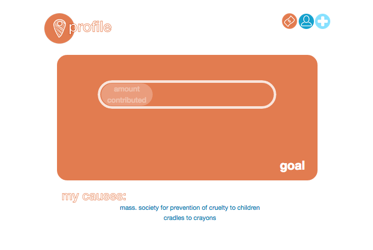

#give local

Give Local is a Rails App that surfaces local causes and charities and enables seemless and hasselfree giving.

Causes and charities can add themselves to the database through a new form.

The functionality of the app works however the alpha version does not support the actual exchange of money, the accounts for both users and causes are placeholders.

Upcoming features include: geolocation of users and causes, integration of a payment and exchange infastructure.

Give Local's URL: givelocal.herokuapp.com